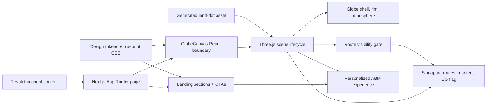

<h1 align="center">Acme Demo</h1>

<h2 align="center">Personalized bank-connectivity ABM page for Revolut</h2>

<p align="center">
  <a href="https://acme-demo.vercel.app/">Website</a> ·
  <a href="./PRODUCT.md">Product notes</a> ·
  <a href="./DESIGN.md">Design notes</a> ·
  <a href="./docs/globe-architecture.md">Globe architecture</a> ·
  <a href="#architecture">Architecture</a>
</p>

<br />

# Why Acme Demo

Acme Demo is a personalized account-based marketing page for Revolut. The goal is to make bank connectivity feel concrete: Singapore as the regional hub, SEA corridors as live infrastructure, and Acme as the team that turns bank relationships, integrations, and implementation work into a faster launch path.

This is not a generic fintech landing page. It is a portfolio-grade artifact showing how a named-account sales motion can combine commercial research, brand personalization, technical storytelling, and polished frontend execution.

## Quick Start

```bash
pnpm install
pnpm dev
```

Open `http://127.0.0.1:3000/`. The legacy `/3d` route redirects to `/`.

## Philosophy

Personalization should be visible. The page speaks directly to Revolut, uses a Revolut proposal badge, and frames the content around Singapore and SEA expansion rather than generic API claims.

Infrastructure should feel physical. The globe, routes, markers, blueprint grid, and Singapore hub turn bank connectivity into something spatial and inspectable.

Motion should support comprehension. Routes draw from Singapore only while the hub is visible, reset while hidden, and respect reduced-motion preferences.

Portfolio polish comes from precision. Alignment, copy density, route timing, color choices, and small interaction details matter more than decorative SaaS effects.

## What We Built

Revolut personalization - account-specific content, proposal framing, Revolut badge treatment, and brand-aware blue UI accents.

SEA connectivity story - Singapore-centered copy, launch workflows, bank-relationship positioning, and integration timeline messaging.

3D infrastructure hero - custom Three.js globe with generated land dots, Singapore-origin corridors, route draw timing, rim lighting, and a hub marker.

Singapore hub treatment - data-driven hub detection, red hub marker, small SG flag label, and muted blue route hierarchy for secondary/quiet corridors.

Responsive landing system - first-viewport hero, CTA treatment, proof sections, reference cards, and mobile-safe layout behavior.

Operational QA - unit tests for content, route visibility, land geometry, and globe route behavior, plus Playwright smoke tests for startup, redirects, and reduced motion.

## System Shape

Acme Demo is easiest to understand as a personalized content layer wrapped around a live globe scene:

1. **Account content** - typed Revolut campaign copy defines the hero, sections, CTAs, and Singapore-specific messaging.
2. **Landing shell** - React sections render the ABM narrative, badge, CTAs, reference content, and reveal behavior.
3. **Design system** - CSS tokens, blueprint background, and landing styles define the visual language.
4. **Globe runtime** - a React canvas boundary starts an imperative Three.js scene for globe rendering, route animation, resizing, and cleanup.
5. **Generated geography** - country polygons are converted into a static land-dot cloud imported by the browser at runtime.

The important boundary is intentional: the React app owns content and layout, while the Three.js scene owns rendering and animation. Route visibility stays pure and testable so the cinematic behavior does not become guesswork.

## Architecture



The app is a Next.js App Router project with Tailwind CSS and local design tokens. The globe uses Three.js directly instead of a wrapper library so the scene can control camera distance, WebGL readiness, route draw windows, reduced-motion behavior, and disposal. Generated land dots keep startup fast by avoiding runtime geography parsing.

## Stack

- Next.js App Router
- React 19
- TypeScript
- Tailwind CSS
- Three.js
- Vitest and Testing Library
- Playwright
- Vercel

## Key Files

- `app/page.tsx` - canonical landing route.
- `app/3d/page.tsx` - compatibility redirect to `/`.
- `src/content/accounts/revolut.ts` - account-specific Revolut campaign content.
- `src/content/landingSchema.ts` - typed landing content model.
- `src/components/landing/HeroShared.tsx` - hero narrative, Revolut badge, and CTAs.
- `src/components/landing/HeroSection3d.tsx` - hero and globe composition.
- `src/components/landing/AbmReferenceSections.tsx` - supporting ABM sections.
- `src/components/globe/GlobeCanvas.tsx` - canvas sizing, readiness, and reduced-motion bridge.
- `src/components/globe/createGlobeScene.ts` - Three.js scene lifecycle and animation loop.
- `src/components/globe/globeRoutes.ts` - corridor arcs, hub detection, markers, SG flag, and route draw state.
- `src/components/globe/routeVisibility.ts` - pure Singapore-frontness route gate.
- `src/components/globe/landTexture.ts` - generated land-dot geometry and shader material.
- `scripts/build-globe-assets.mjs` - generates `src/generated/globe-land-dots.ts`.
- `docs/globe-architecture.md` - focused globe implementation notes.
- `HANDOVER.md` - source, deployment, and takeover notes.

## Generated Globe Asset

The dotted landmass cloud is generated from `scripts/source/world-countries.json` into `src/generated/globe-land-dots.ts`.

```bash
pnpm generate:globe
```

Commit the generated file when the source geography or dot sampling changes.

## Health Checks

```bash
pnpm lint
pnpm test -- --run
pnpm build
pnpm test:e2e
```

`pnpm test:e2e` runs Chromium desktop and mobile-emulated smoke checks for the globe startup path, `/3d` redirect, and reduced-motion readiness.

## Deployment

The app deploys to Vercel as `acme-demo`.

```bash
pnpm lint
pnpm test -- --run
pnpm build
vercel deploy --prod --yes --scope sethzys-projects
```

This repository is the canonical app source; the GTM workspace is not the app source of truth.
